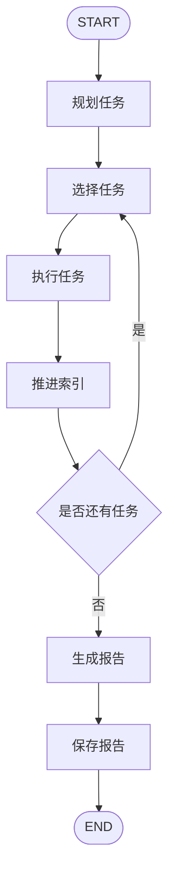
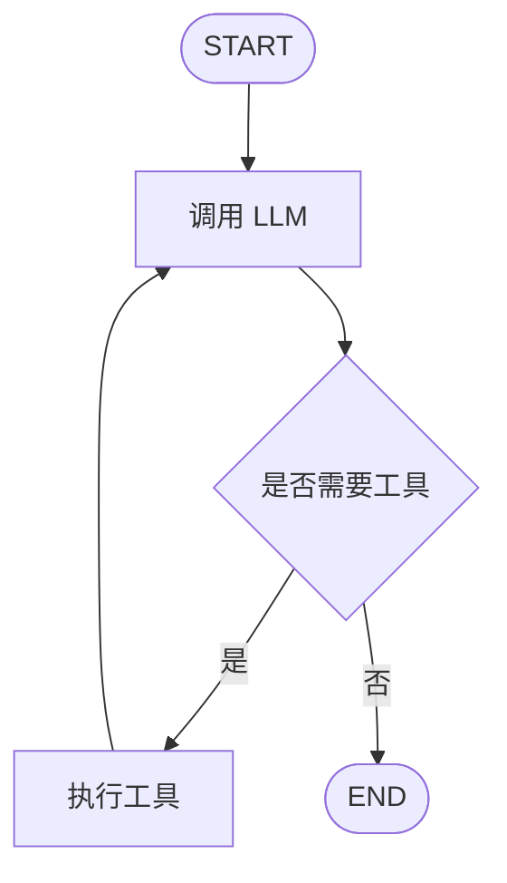

# LangGraph DeepResearch Agent

### 基于 LangGraph 的自动化深度研究智能体

面向复杂研究主题的多阶段 Agent 应用实践：输入一个研究主题，系统自动完成任务拆解、资料检索、单任务总结与最终报告生成。

> 本项目基于 Hello-Agents 中“自动化深度研究智能体”案例进行实现与整理，重点实践 Agent 工作流编排、工具调用、搜索增强与报告生成。

---

## 项目介绍

LangGraph DeepResearch Agent 是一个自动化深度研究助手。项目围绕“研究主题 → 子任务规划 → 信息检索 → 任务总结 → 报告生成”的流程展开，通过多个 Agent 角色协作完成结构化研究任务。

项目核心关注点不是前端页面或普通接口开发，而是如何组织一个可运行的 Agent 工作流：

- 如何将复杂研究主题拆解为多个可执行任务；
- 如何让 Agent 调用搜索、笔记等工具获取外部信息；
- 如何维护研究过程中的任务状态、搜索结果和中间总结；
- 如何将多个任务结果整合成一份结构化 Markdown 报告；
- 如何使用 LangGraph 对非流式研究流程进行状态图编排。

前端和 FastAPI 主要用于输入研究主题、触发研究流程和展示研究结果。

---

## 快速开始

### 1. 克隆项目

```bash
git clone https://github.com/jwine1/Langgraph-deepresearch.git
cd Langgraph-deepresearch
```

### 2. 安装后端依赖

当前项目暂未提供统一的 `requirements.txt`，可先手动安装核心依赖：

```bash
cd backend

pip install openai python-dotenv fastapi uvicorn pydantic loguru \
  langgraph hello-agents duckduckgo_search requests typing_extensions
```

### 3. 配置环境变量

在 `backend` 目录下创建 `.env` 文件，并根据自己的模型和搜索后端填写配置。

示例：

```env
LLM_PROVIDER=custom
LLM_MODEL_ID=your-model-name
LLM_API_KEY=your-api-key
LLM_BASE_URL=https://your-api-base-url/v1

SEARCH_API=duckduckgo
ENABLE_NOTES=true
NOTES_WORKSPACE=./notes

HOST=0.0.0.0
PORT=8000
```

如果使用 Ollama 或 LMStudio，也可以配置本地模型服务地址。

### 4. 启动后端

```bash
cd backend
python src/main.py
```

默认服务地址：

```text
http://localhost:8000
```

健康检查：

```bash
curl http://localhost:8000/healthz
```

### 5. 启动前端

```bash
cd frontend
npm install
npm run dev
```

前端主要用于演示研究主题输入和流式结果展示。

---

## 你将看到什么

输入一个研究主题后，系统会依次完成：

1. 生成研究 TODO 列表；
2. 对每个子任务执行搜索；
3. 整理搜索结果并构建研究上下文；
4. 生成单任务总结；
5. 汇总所有任务生成最终 Markdown 报告；
6. 在启用笔记功能时，将任务信息和最终报告保存到本地 Markdown 文件。

---

## 核心功能

### 任务规划

规划 Agent 会根据用户输入的研究主题生成多个子任务，每个任务包含标题、研究意图和搜索查询语句。

### 搜索调度

项目封装了统一搜索调度逻辑，可根据配置调用不同搜索后端，并将结果整理为适合 LLM 处理的研究上下文。

支持的搜索后端包括：

- DuckDuckGo
- Tavily
- Perplexity
- SearXNG

### 任务总结

总结 Agent 会基于当前任务和搜索上下文生成单任务总结，并支持流式输出。

### 报告生成

报告 Agent 会整合多个任务的总结和来源信息，生成结构化 Markdown 报告。

### 工具调用

项目保留了 HelloAgents 风格的文本工具调用协议：

```text
[TOOL_CALL:tool_name:parameters]
```

通过 `ToolRegistry` 管理工具，通过 `ToolAwareSimpleAgent` 解析工具调用、执行工具并将结果回灌给 LLM。

### LangGraph 工作流

非流式研究流程使用 LangGraph `StateGraph` 编排，核心流程如下：



Agent 内部工具调用循环也使用 LangGraph 表达：



---

## 项目结构

```text
Langgraph-deepresearch/
├── backend/
│   └── src/
│       ├── main.py                  # FastAPI 入口
│       ├── agent.py                 # DeepResearchAgent 与 LangGraph 工作流
│       ├── config.py                # 配置读取
│       ├── models.py                # 状态模型与任务模型
│       ├── prompts.py               # Agent 提示词
│       ├── utils.py                 # 通用文本处理函数
│       └── services/
│           ├── planner.py           # 任务规划
│           ├── summarizer.py        # 任务总结
│           ├── reporter.py          # 报告生成
│           ├── search.py            # 搜索调度与上下文构建
│           ├── search_tool.py       # 搜索工具
│           ├── note_tool.py         # 本地笔记工具
│           ├── tool_events.py       # 工具调用事件追踪
│           └── myagent/
│               ├── agents/
│               │   ├── simple_agent.py
│               │   └── tool_aware_agent.py
│               ├── core/
│               │   ├── base_agent.py
│               │   ├── llm.py
│               │   └── message.py
│               └── tools/
│                   ├── base.py
│                   └── registry.py
└── frontend/
    ├── package.json
    ├── vite.config.ts
    └── src/
        ├── App.vue
        ├── main.ts
        └── services/
            └── api.ts
```

---

## 技术栈

- Python
- LangGraph
- HelloAgents / hello-agents
- OpenAI-compatible LLM API
- FastAPI
- Pydantic
- DuckDuckGo / Tavily / Perplexity / SearXNG
- Vue 3
- TypeScript
- Vite

---

## API 示例

### 同步研究

```bash
curl -X POST http://localhost:8000/research \
  -H "Content-Type: application/json" \
  -d '{"topic": "多模态大模型的最新发展趋势"}'
```

### 流式研究

```bash
curl -X POST http://localhost:8000/research/stream \
  -H "Content-Type: application/json" \
  -d '{"topic": "AI Agent 在软件工程中的应用"}' \
  --no-buffer
```

---

## 配置说明

常用环境变量：

| 变量名 | 说明 |
|---|---|
| `LLM_PROVIDER` | LLM 提供商，如 `ollama`、`lmstudio`、`custom` |
| `LLM_MODEL_ID` | 模型名称 |
| `LLM_API_KEY` | 模型 API Key |
| `LLM_BASE_URL` | OpenAI-compatible API 地址 |
| `LOCAL_LLM` | 本地模型名称 |
| `OLLAMA_BASE_URL` | Ollama 服务地址 |
| `LMSTUDIO_BASE_URL` | LMStudio 服务地址 |
| `SEARCH_API` | 搜索后端 |
| `TAVILY_API_KEY` | Tavily API Key |
| `PERPLEXITY_API_KEY` | Perplexity API Key |
| `SEARXNG_BASE_URL` | SearXNG 服务地址 |
| `ENABLE_NOTES` | 是否启用笔记 |
| `NOTES_WORKSPACE` | 笔记保存目录 |
| `HOST` | 后端服务地址 |
| `PORT` | 后端服务端口 |
| `CORS_ORIGINS` | 允许跨域来源 |

请不要将包含真实密钥的 `.env` 文件提交到 GitHub。

---

## 使用建议

如果你想重点理解本项目，可以按以下顺序阅读代码：

1. `backend/src/agent.py`
2. `backend/src/services/planner.py`
3. `backend/src/services/search.py`
4. `backend/src/services/summarizer.py`
5. `backend/src/services/reporter.py`
6. `backend/src/services/myagent/agents/tool_aware_agent.py`
7. `backend/src/services/myagent/tools/registry.py`

---

## 后续计划

- 补充 `requirements.txt` 或 `pyproject.toml`
- 补充 `.env.example`
- 增加基础测试
- 将流式研究流程进一步迁移到 LangGraph stream / astream
- 增加 checkpoint，支持长任务中断恢复
- 优化搜索失败重试与错误提示
- 完善前端展示效果

---

## 致谢

本项目基于 HelloAgents / hello-agents 中的自动化深度研究智能体案例进行实践和整理。

感谢以下项目和工具生态：

- HelloAgents
- LangGraph
- LangChain
- FastAPI
- Vue / Vite

---

## License

MIT License
